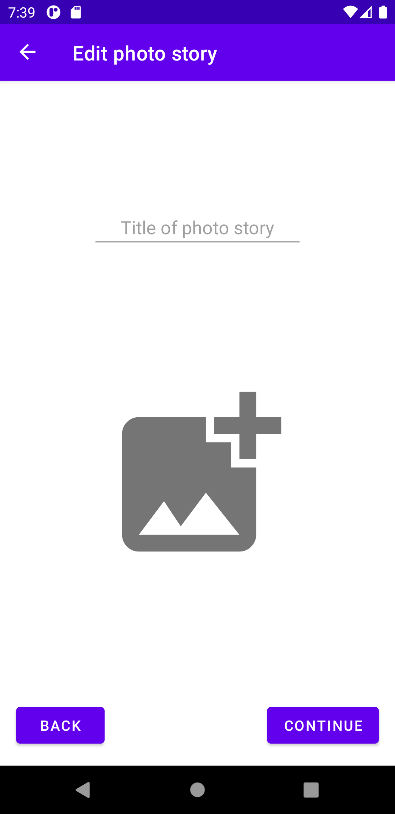

# PhotostoryBook-AndroidApp
Android app to create photostories from your photos. You can select picture, change the order of the picture and change titles show in the slide show.

## Screenshots

Pictures are courtesy of NASA. See https://www.nasa.gov/mission_pages/msl/images/index.html

## Status

The app is currently in development for minimum Android SDK verion 23 (Android 6 Marshmallow).

